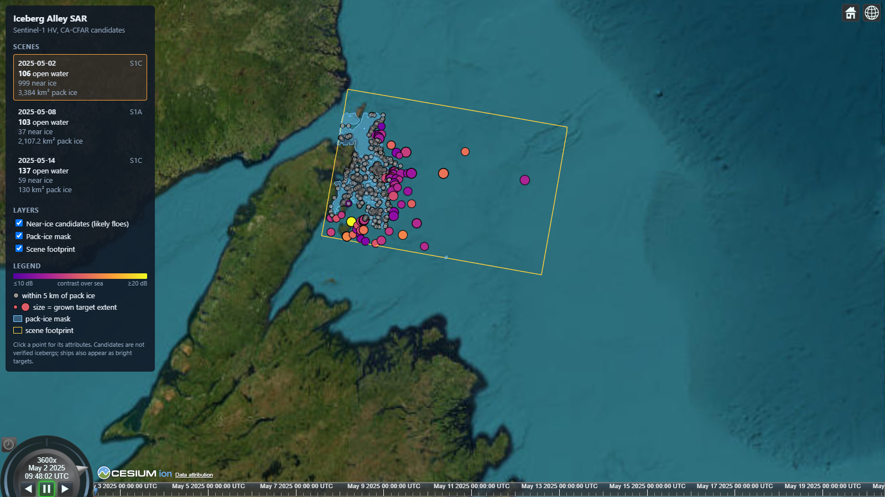
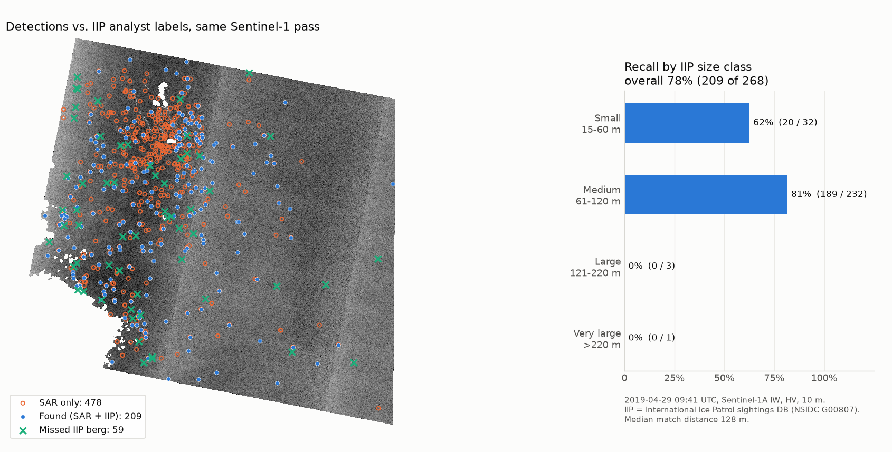
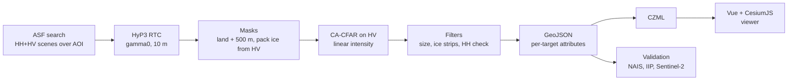
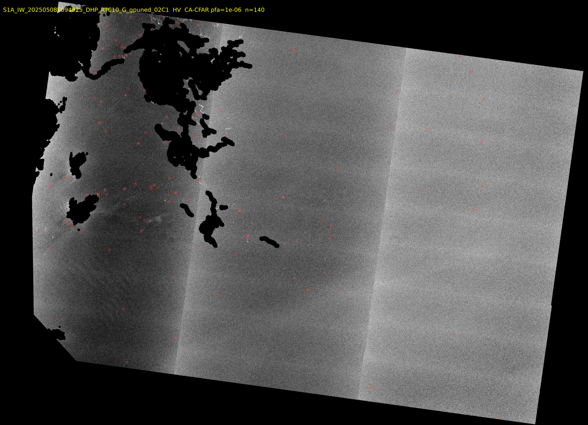

# Iceberg Alley SAR

Detecting icebergs off Newfoundland & Labrador in Sentinel-1 radar imagery, and putting them on an interactive CesiumJS globe with a timeline.



**In short:** a CFAR detector on Sentinel-1 cross-pol (HV) imagery finds **78% of the icebergs that International Ice Patrol analysts marked** on the same satellite pass (208 of 268, median position difference 136 m). It runs end to end with one command, from scene search to a time-dynamic CZML file for the viewer.

## The problem

Every spring, icebergs calved from Greenland glaciers drift south along the Labrador Current into "Iceberg Alley", the stretch of ocean off Newfoundland's northeast coast. They are a hazard to shipping, fishing vessels and offshore platforms on the Grand Banks. Aircraft reconnaissance is expensive and limited by weather. Synthetic aperture radar (SAR) sees through cloud and darkness, so satellite SAR is the main tool for wide-area iceberg surveillance.

This project builds that pipeline on free Copernicus Sentinel-1 data, for the coast from Bonavista to St. Anthony, and checks it against the ground truth that exists.

## Results

| | |
|---|---|
| **Recall vs. same-pass IIP analyst labels** (2019-04-29) | **78%** (208 / 268), median offset 136 m |
| Recall by berg size | small (15–60 m) 62%, medium (61–120 m) 81%, large (> 120 m) 0 of 4 |
| Recall by distance from the coast | stable, 73–84% from 0 to 100 km |
| Precision | not measurable without AIS ship positions (lower bound 39%) |
| Runtime | about 17 min per 10 m scene on a laptop (masking + detection), after HyP3 processing |



The viewer shows three spring 2025 passes (2025-05-02, 05-08, 05-14). In the 1° squares each scene covers, open-water detections are within 2–4× of the North American Ice Service chart estimate (106 vs. 26, 98 vs. 31, 137 vs. 71). The chart is per 1° square and partly modelled, so this is a sanity check, not a measurement. The full validation story, including the sources that didn't work, is in [docs/validation-findings.md](docs/validation-findings.md).

## Data

| Source | Use |
|---|---|
| **Sentinel-1 IW GRD** (Copernicus, via [ASF](https://search.asf.alaska.edu)) | Radar imagery, HH + HV polarization |
| **ASF HyP3 RTC** | Terrain-corrected, calibrated GeoTIFFs: gamma0, linear power, 10 m, with incidence-angle map |
| **OpenStreetMap land polygons** | Land mask, buffered 500 m to remove coastal clutter |
| **NAIS daily iceberg chart** (IIP + Canadian Ice Service) | Count check per 1° square |
| **IIP Iceberg Sightings Database** (NSIDC G00807) | Per-berg validation (database ends with the 2021 season) |
| **Sentinel-2 L2A** (Earth Search) | Optical cross-check |

## Method



A few SAR terms, briefly:
- **Backscatter** is how much radar energy a surface returns to the satellite. Calm water reflects energy away, so it is dark. An iceberg's edges and facets reflect energy back, so it is bright.
- **Polarization:** HH sends and receives horizontally polarized waves, HV sends horizontal and receives vertical. Sea clutter is much weaker in HV, so icebergs stand out more there. Detection runs on HV, and HH is a second check.
- **Speckle** is the grainy noise in every SAR image. Its statistics set the detection threshold. **ENL** (equivalent number of looks) measures how strong it is.
- **CFAR** (constant false alarm rate) compares each pixel with its local background instead of using a fixed threshold, so the false-alarm rate stays the same in calm and rough water.
- **dB vs. linear:** detection math runs on linear power. Reported values and displays use decibels.


*HV backscatter on 2025-05-08 with land and pack ice masked (black) and detections circled in red. The vertical brightness steps are the three IW sub-swaths.*

The pipeline steps (parameters in [config.yaml](config.yaml), lengths in metres so tuning carries over between 10 m and 20 m pixels):

1. **Masks.** Land from OSM, buffered 500 m. Pack ice from HV statistics on 200 m cells: pack ice is bright and uniform, open water is dark, and a cell with an iceberg is spiky. Pack ice is masked with a 1 km buffer, and each detection keeps its distance to the ice.
2. **CA-CFAR on HV.** The background is the mean of a ring (400 m half-width, minus a 100 m guard window that keeps the target's own energy out). The threshold comes from a false-alarm rate of 10⁻⁶ under a gamma speckle model, with ENL estimated from the scene. HyP3 removes the HV thermal noise floor, so open-water HV sits at −30 to −40 dB with ENL below 1. A textbook ENL would set the threshold far too low.
3. **Connected components** of 2 px to 0.8 km². Components within 200 m of land, ice or nodata are dropped.
4. **Ice-strip rejection.** Each target is grown to the region more than 4 dB above background. Structures longer than 300 m are thin strips of loose ice, not bergs.
5. **HH co-pol check.** A target must also be 6 dB above background in HH. 10 m IW GRD is oversampled (true resolution about 20 m), so HV speckle grains span about 2×2 px and pass the size filter. Real targets are bright in both polarizations.
6. **Output:** GeoJSON points with area, extent, structure length, peak and mean dB per band, contrast, incidence angle and distance to pack ice. CZML for the viewer, with one time interval per scene.

How the detector was tuned is in [docs/milestone2-cfar-findings.md](docs/milestone2-cfar-findings.md).

## Quickstart

Requires Python 3.11+, Node 20+, and a free [NASA Earthdata](https://urs.earthdata.nasa.gov) account. In Earthdata, go to Applications > Authorized Apps and approve **ASF HyP3**, otherwise HyP3 refuses API logins.

```powershell
git clone https://github.com/natali-kovalski/iceberg-alley-sar.git
cd iceberg-alley-sar
py -3.11 -m venv .venv
.venv\Scripts\Activate.ps1
pip install -e ".[dev]"
copy .env.example .env             # fill in EARTHDATA_USERNAME / EARTHDATA_PASSWORD
python -m iceberg_sar.cli init-dirs
```

Run the whole pipeline for the demo dates, then open the viewer:

```powershell
python -m iceberg_sar.cli run --start 2025-05-01 --end 2025-05-15 --dry-run   # plan + credit estimate
python -m iceberg_sar.cli run --start 2025-05-01 --end 2025-05-15
cd viewer
npm install
npm run dev                        # http://localhost:5173
```

`run` does the following:
1. Searches ASF for HH+HV scenes over [aoi.geojson](aoi.geojson) and keeps the `run.max_scenes` (default 3) that cover the AOI best.
2. Orders HyP3 RTC jobs, waits for them (often 30–60 min) and downloads them. Each 10 m scene costs 60 of the monthly HyP3 credits, and `--dry-run` shows the total first.
3. Builds the land mask (one-time ~900 MB OSM download), preprocesses each scene, runs detection, and writes `viewer/public/data/iceberg_alley.czml`. The CZML holds every scene processed so far, not just this run's dates, so the viewer accumulates seasons.

Re-runs reuse everything on disk: downloaded products, masked rasters and detections. Use `--force` to redo preprocessing and detection after changing parameters. Without `--start`/`--end`, the dates come from `search` in `config.yaml`.

In the viewer:
- Scrub the timeline to step through passes, and click a target to see its attributes.
- Open-water targets are coloured by contrast and sized by structure length. Targets within 5 km of pack ice are grey (likely ice floes), and a checkbox hides them.
- Toggle the scene footprint and the pack-ice mask.
- The basemap is Esri World Imagery, so no Cesium ion token is needed. `npm run build` gives a static site in `viewer/dist/`.

## Individual steps

`run` chains these, and each can be run on its own (`--help` on any command):

```powershell
python -m iceberg_sar.cli search --pol HH+HV                 # scene list + footprints -> data/outputs/
python -m iceberg_sar.cli order <granule>                    # one HyP3 RTC job (skips if already ordered)
python -m iceberg_sar.cli download                           # wait, download, unzip to data/raw/
python -m iceberg_sar.cli land-mask
python -m iceberg_sar.cli preprocess data\raw\<product_dir>  # masked linear rasters + dB quicklooks
python -m iceberg_sar.cli detect data\raw\<product_dir>      # CFAR on HV; --band HH to compare
python -m iceberg_sar.cli czml --start 2025-05-01 --end 2025-05-15
```

Outputs (all under the gitignored `data/`):
- `data/interim/<product>/<product>_<POL>_masked.tif`: linear power, masked areas NaN. This is the CFAR input.
- `data/outputs/quicklooks/<product>_<POL>_db.png`: dB quicklook.
- `data/outputs/detections/<product>_HV_detections.{geojson,png,json}`: detections (EPSG:4326), overlay and run summary.

## Validation

```powershell
python -m iceberg_sar.cli ground-truth 2025-05-08                     # NAIS chart GIFs
python -m iceberg_sar.cli validate data\raw\<product_dir> --counts validation\nais_20250508_counts.csv
python -m iceberg_sar.cli iip-sightings 2019                          # IIP sightings season
python -m iceberg_sar.cli validate-points data\raw\<product_dir> --truth iip-satellite --no-open-water
python -m iceberg_sar.cli s2-targets data\raw\<product_dir>           # Sentinel-2 optical targets
python -m iceberg_sar.cli validate-points data\raw\<product_dir> --truth s2
```

- The NAIS chart is published only as an image. The counts per 1° square are hand-transcribed in [validation/](validation/).
- Point matching is one-to-one (Hungarian assignment) within 500 m. When the truth is not simultaneous with the radar pass, a common drift offset is estimated and checked against chance.

The headline number uses IIP sightings marked on the same Sentinel-1 pass. That has no drift, but it is not independent: the analysts looked at the same radar image. Aircraft sightings (5–7 h later) and Sentinel-2 (loose sea ice in April, bergs mostly inshore in June) were inconclusive. The details are in [docs/validation-findings.md](docs/validation-findings.md).

## Limitations

- **Precision is unknown.** 326 of 534 detections on the validation pass have no IIP label. They are a mix of unrecorded bergs, fishing vessels and false alarms, in unknown proportions. Separating them needs AIS vessel positions.
- **Large bergs are missed** (0 of 4 over 120 m). The 300 m strip filter and a guard window smaller than the berg are the likely causes.
- **Small bergs are harder** (62% recall), and single-pixel targets are removed by the 2 px minimum.
- **Sea state matters.** On rougher days the HV background rises 3–4 dB and small bergs lose contrast.
- **Near pack ice, many detections are ice floes.** They are flagged by distance to ice, not removed.
- **CA-CFAR with gamma speckle** understates the heavy tails of real sea clutter, so the actual false-alarm rate is higher than 10⁻⁶. OS-CFAR or K-distribution CFAR is the obvious next step (`cfar.variant` has a slot for it).
- **No ship/iceberg discrimination** you can rely on (see the experimental classifier below).

## Experimental: iceberg vs. ship classifier

A small CNN trained on the Kaggle [Statoil/C-CORE Iceberg Classifier Challenge](https://www.kaggle.com/c/statoil-iceberg-classifier-challenge) chips adds `iceberg_prob` to each detection. On Kaggle it reaches 0.23 log loss (5-fold out-of-fold, 90% accuracy). On our scenes it is mostly unsure, and two model variants agree on only 70% of open-water targets. **Use it as a sort key for review, not as a label.**

```powershell
pip install -e .[ml]                           # torch, scikit-learn, py7zr
# put train.json from Kaggle in data/kaggle/ (competition terms: don't redistribute)
python -m iceberg_sar.cli train-classifier
python -m iceberg_sar.cli classify data\raw\<product_dir>
```

<details>
<summary>How the chips were matched to Kaggle, and why the output is a weak hint</summary>

- *Resolution matches.* Kaggle chips have the same speckle correlation (lag-1 ≈ 0.6) and ENL (≈ 4) as our 10 m RTC, and 1,470 of 1,471 incidence angles fall in the IW swath (29–46°). Chips are cut at native 10 m.
- *Radiometry doesn't match, so it is corrected.* HyP3 gives gamma0 and Kaggle is sigma0, so chips are multiplied by cos(incidence). HyP3 also removes the HV noise floor (calm sea ≈ −40 dB) while Kaggle keeps it (−24 to −29 dB), so speckled noise is added to match the Kaggle HV background at each incidence angle.
- Kaggle's missing incidence angles are all ships. They are imputed to the mean so the model can't learn that leak.
- On Kaggle, 79% of chips get p < 0.2 or > 0.8. On our 343 open-water detections, only 26% do.
- Most of our targets are 2–10 px, against a Kaggle median of about 74 px above background, so small targets are out of distribution.
- Shifting the HV noise floor by ±2 dB changes p by 0.07 on average and flips 9–13% of labels.
- Near pack ice, chips contain ice texture Kaggle never shows, so p is meaningless there.

</details>

## Repository layout

- `config.yaml`: all parameters. `aoi.geojson`: the area of interest (EPSG:4326).
- `src/iceberg_sar/`: the pipeline. `pipeline.py` is the end-to-end `run`, `cfar.py` + `detections.py` the detector, `seaice.py` the pack-ice mask, `export_czml.py` the viewer export, `classify/` the experimental CNN.
- `viewer/`: Vue 3 + Vite + CesiumJS (`src/scene.ts` holds the Cesium logic).
- `docs/`: findings write-ups and figures. `validation/`: transcribed NAIS chart counts.
- `tests/`: pytest suite (`pytest`). `data/`: everything downloaded or generated (gitignored).

## Data terms

- Contains modified Copernicus Sentinel data (2019–2025), via ASF DAAC and Earth Search (Element 84).
- Iceberg charts: North American Ice Service (International Ice Patrol + Canadian Ice Service).
- Iceberg sightings: International Ice Patrol Iceberg Sightings Database, NSIDC G00807.
- Land polygons: © OpenStreetMap contributors, ODbL.
- Kaggle Statoil/C-CORE chips: used under the competition terms and not redistributed.
